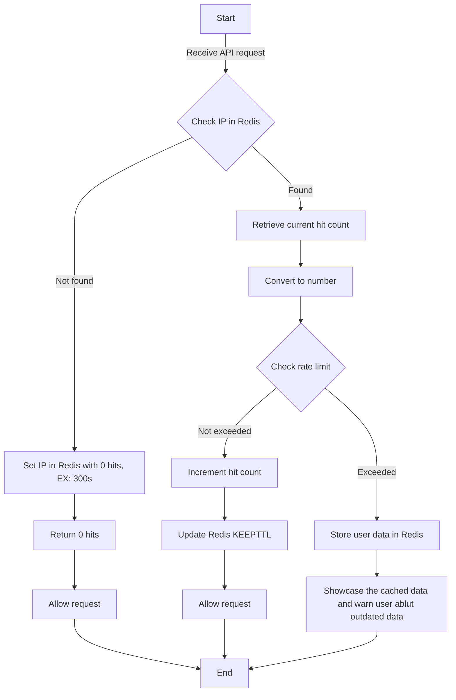

## 📊 Rate Limiting Logic

The user data is limited to avoid abuse by users. It is cached by Redis once rate limit reached to keep data filled. 

```mermaid
graph TD
  A[Start] -->|Receive API request| B{Check IP in Redis}

  B -- Not found --> C[Set IP in Redis with 0 hits, EX: 300s] --> D[Return 0 hits] --> E[Allow request]
  B -- Found --> F[Retrieve current hit count] --> G[Convert to number] --> H{Check rate limit}

  H -- Not exceeded --> I[Increment hit count] --> J[Update Redis KEEPTTL] --> K[Allow request]
  H -- Exceeded --> L[Store user data in Redis] --> M[Showcase the cached data and warn user ablut outdated data]

  E --> N[End]
  K --> N
  M --> N


```
