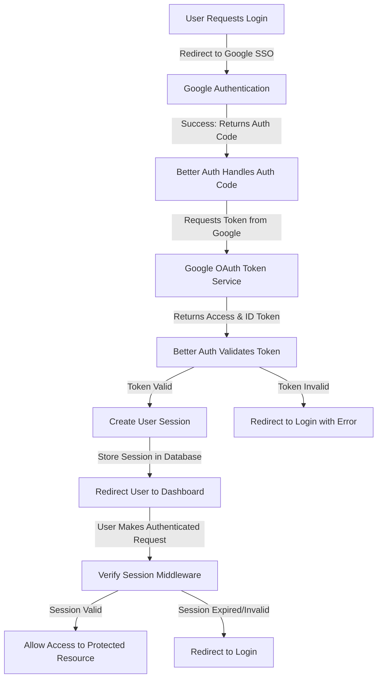

## Authentication Workflow

The authentication will be handled through a **session-based authentication service**. Specifically, we will be employing the better-auth library to abstract most of the logic required to build the authentication.

