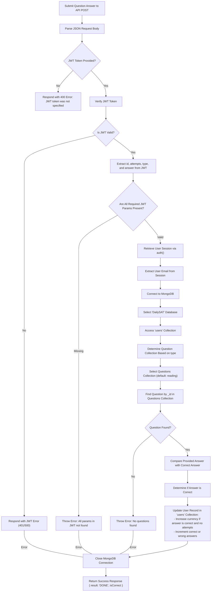

## 📝 Handling Submitting of SAT Questions

This flow visually shows the logic that was implemented for submitting a math/reading and writing question for checking its correctness + earning DailySAT Coins

