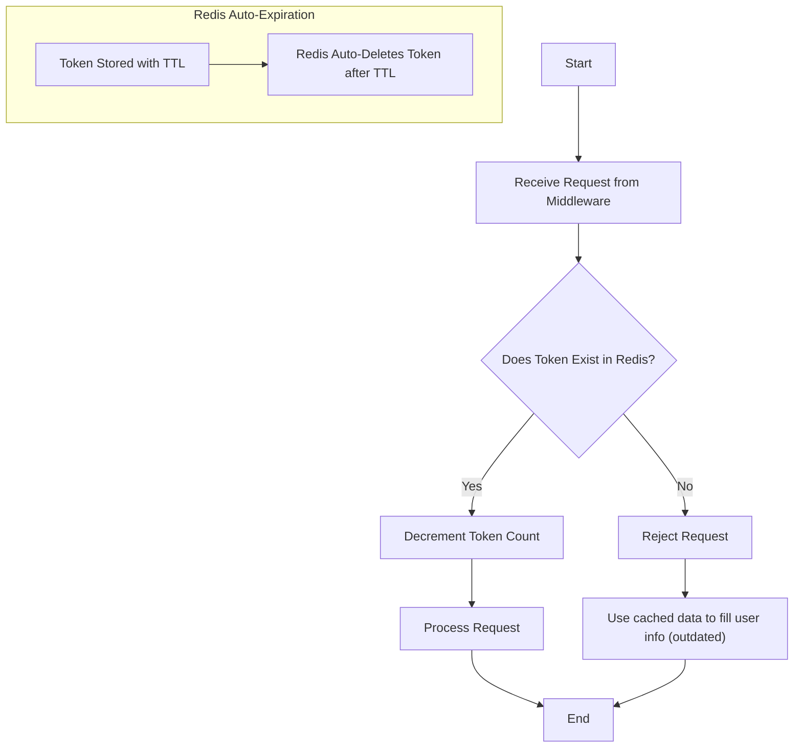

## 📊 Rate Limiting Logic

The user data is limited to avoid abuse by users. It is cached by Redis once rate limit reached to keep data filled. 
 
The current algorithm that is employed is the Token Bucket algorithm, look at diagram to understand how it is implemented in DailySAT.

